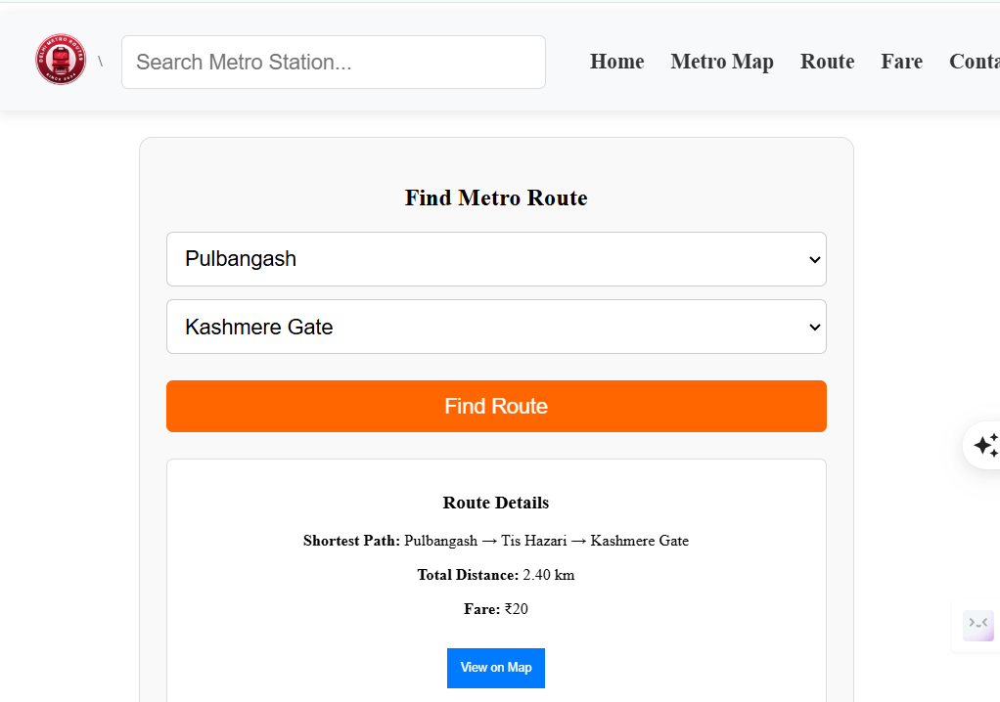

# 🚇 Delhi Metro Route Finder

A full-stack web application that allows users to find the **shortest metro route** between any two stations in the Delhi Metro network. It provides details like route, distance, estimated travel time, fare, and interchanges — along with an interactive Google Map.

---

## 📸 Screenshots

---

## ⚙️ Tech Stack

### Frontend
- ReactJS
- Styled Components
- Axios

### Backend
- Flask (Python)
- NetworkX (for shortest path algorithm)
- JSON (as data source for stations)

---

## 🧠 Features

- 🔍 Search for any source & destination station
- 🛣️ Calculate the shortest path using graph algorithms
- 🚉 Shows complete route, fare, distance, and interchanges
- 🗺️ Interactive Google Map showing the route
- ⚡ Fast and lightweight design

---

## 🔌 APIs Used

- `GET /stations` – Fetch all metro stations
- `GET /metro/shortest-path?src=Kashmere Gate&dest=Pulbangash` – Calculate shortest route
- Google Maps Directions API – (Optional for visual route)

---

Let me know if you'd like a **version with live images, badges, deployment instructions, or GitHub profile-style portfolio format**.

